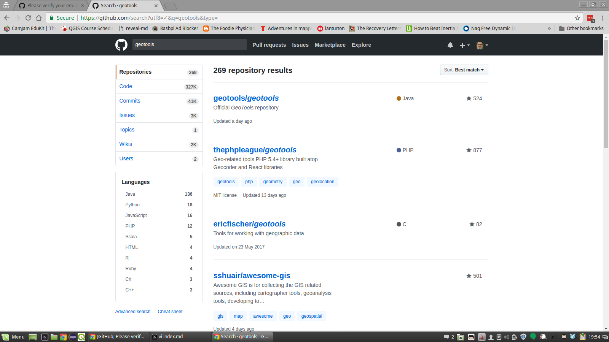
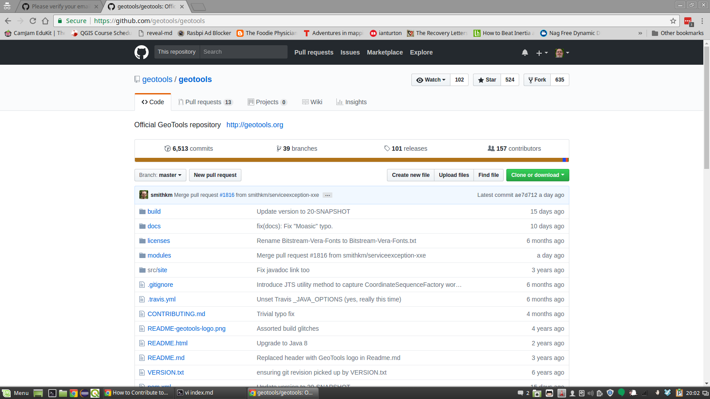
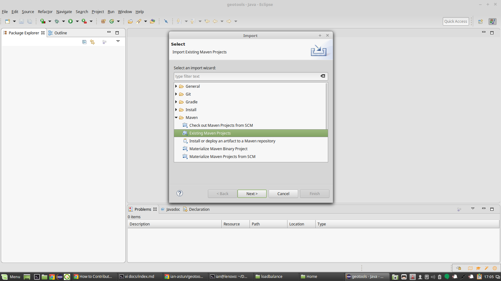
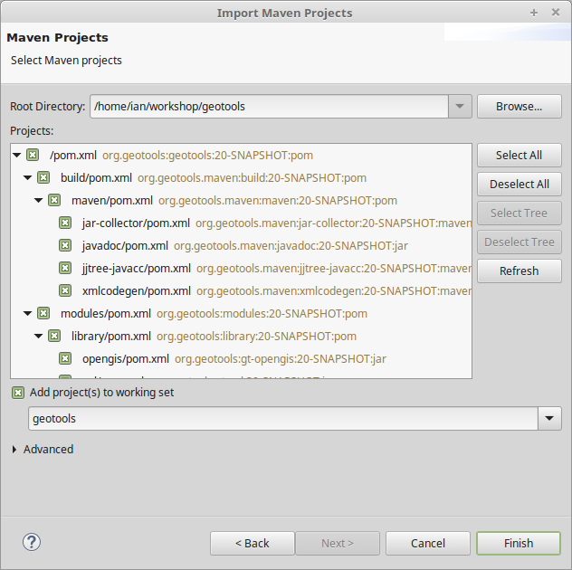
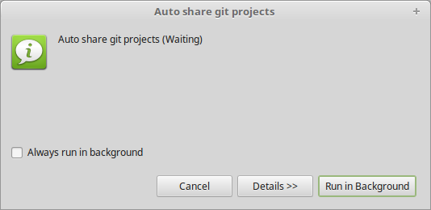
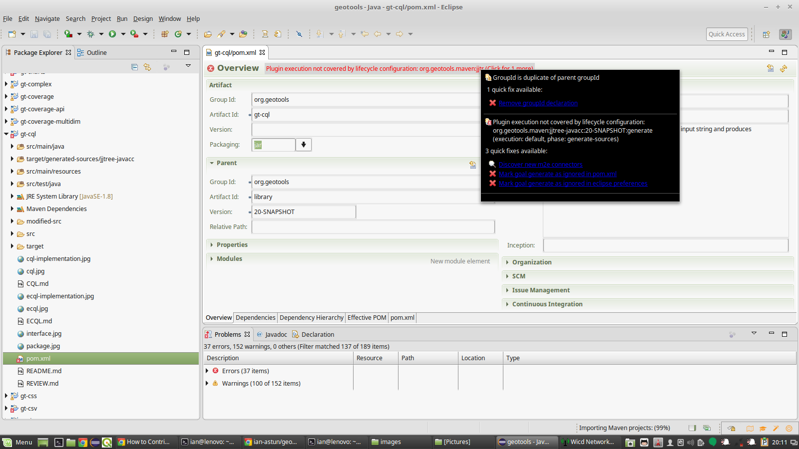
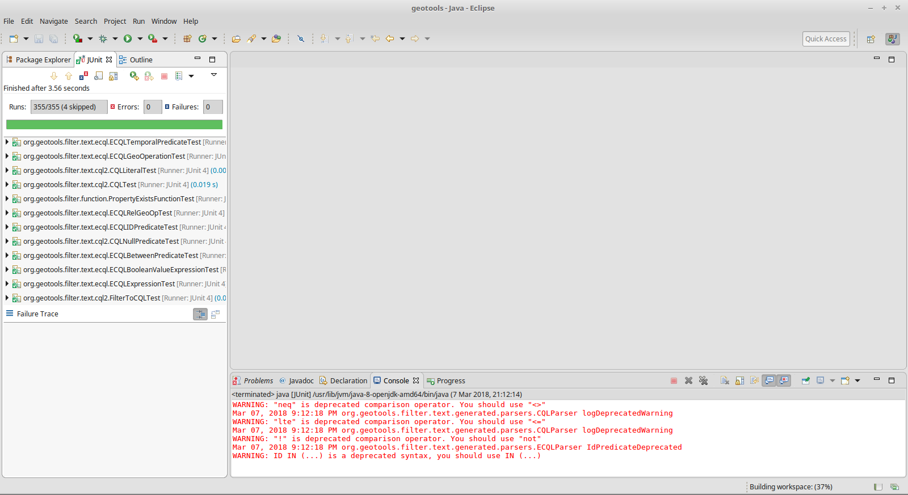

# How to Contribute to GeoTools and GeoServer

This site is designed to help new developers join and contribute to the [GeoTools](http://geotools.org) and 
[GeoServer](http://geoserver.org) projects.

# GitHub, Repositories and Forks

GeoTools is the library that is used to build GeoServer (and other projects) so
the first thing we need to do is get a copy of the source code it needs.

## Log on to GitHub

Goto [GitHub](github.com) and either create an account or log into your
existing account. 

## Fork the Repository

Goto the search box in the **top left** corner and type `GeoTools` in and press
return. 

Click on the **official** GeoTools (`geotools/geotools`) this is the master
repository where the **master** version of GeoTools lives. 

So that the changes we make today don't affect other people until we want them
to we need a copy of the master version. In git terms this is known as *forking*
the repository. To do this click on the `fork` button in the top right corner.
After a little while you will see a very similar page but with your name in the
top left corner (`ian-astun/geotools`) this is your copy of the GeoTools source
tree (on GitHub).

## Fetch the code onto your local machine

Before we can do anything to change the code we will need to get a copy on our
local machine. This is called *cloning* the repository because it uses the git
clone command. So you will need a command window (terminal etc) and then
navigate to your code directory. Your url will be different but if you click on
the green clone or download button you can copy the URL shown - I prefer to use
SSH rather than HTTPS, if SSH doesn't scare you then click on that link, either
way copy the URL and paste it into the following command.

    git clone https://github.com/ian-astun/geotools.git

This will fetch a compressed copy of the repository and unpack it into a
directory called geotools.

    ~  git clone git@github.com:ian-astun/geotools.git
    Cloning into 'geotools'...
    remote: Counting objects: 233434, done.
    remote: Compressing objects: 100% (74/74), done.
    remote: Total 233434 (delta 48), reused 65 (delta 19), pack-reused 233325
    Receiving objects: 100% (233434/233434), 168.93 MiB | 1.13 MiB/s, done.
    Resolving deltas: 100% (111761/111761), done.
    Checking out files: 100% (16808/16808), done.
    ~  
    ~  ls
    geotools
    ~ cd geotools 
    ~ ls 
    build            licenses  README-geotools-logo.png  src
    CONTRIBUTING.md  modules   README.html               VERSION.txt
    docs             pom.xml   README.md

## Building GeoTools

Now that you have a local copy of GeoTools you want to compile it, for this we
use **Maven** which takes care of all of our dependency issues.

    ~ mvn clean install -DskipTests -T4C
     [INFO] Scanning for projects...
     [WARNING] 
     [WARNING] Some problems were encountered while building the effective model
     for org.geotools:gt-coverage:jar:20-SNAPSHOT
       [WARNING] 'dependencies.dependency.(groupId:artifactId:type:classifier)'
       must be unique: com.vividsolutions:jts-core:jar -> duplicate declaration
       of version (?) @ org.geotools:gt-coverage:[unknown-version],
       /home/ian/workshop/geotools/modules/library/coverage/pom.xml, line 143,
       column 17
       [WARNING] 

Ignore the *warnings*, if you see an error then you will need to fix something.
The most common issue is that you don't have [Java 8
installed](https://www.java.com/en/download/help/download_options.xml) on your machine
(or possibly [apache-maven](https://maven.apache.org/install.html)). We'll cover
the command line options later but for now if you are curious this tells maven
to clean and then install the source tree, skipping over the tests and running
with 4 threads to speed things up.
 
After a while you will see:

    [INFO]
    ------------------------------------------------------------------------
    [INFO] Reactor Summary:
    [INFO] 
    [INFO] GeoTools ........................................... SUCCESS [  2.731 s]
    [INFO] Build tools for Geotools 2 ......................... SUCCESS [  0.033 s]
    [INFO] Maven plugins for Geotools 2 ....................... SUCCESS [  0.012 s]
    [INFO] JAR files collector ................................ SUCCESS [  7.175 s]
    [INFO] Cross-modules javadoc .............................. SUCCESS [  7.178 s]
    [INFO] JJTree and JavaCC compilers plugin ................. SUCCESS [  7.166 s]
    [INFO] Geotools modules ................................... SUCCESS [  0.044 s]
    [INFO] Geotools libraries ................................. SUCCESS [  0.080 s]
    [INFO] Open GIS Interfaces ................................ SUCCESS [ 11.307 s]
    [INFO] Metadata ........................................... SUCCESS [ 13.488 s]
    [INFO] Sample data module ................................. SUCCESS [  9.182 s]
    [INFO] Referencing services ............................... SUCCESS [ 12.853 s]
    [INFO] API interfaces ..................................... SUCCESS [  9.684 s]
    [INFO] Geotools plugins ................................... SUCCESS [  0.088 s]
    [INFO] EPSG Authority Service using HSQL database ......... SUCCESS [  7.740 s]
    [INFO] Main module ........................................ SUCCESS [ 22.255 s]
    [INFO] Geotools extensions ................................ SUCCESS [  0.081 s]
    [INFO] XML Parsing ........................................ SUCCESS [  0.036 s]
    [INFO] XML Parsing ........................................ SUCCESS [ 17.856 s]
    [INFO] Feature Based Graphs and Networks .................. SUCCESS [ 17.202 s]
    [INFO] XML Code Generation Support ........................ SUCCESS [  6.783 s]
    [INFO] EPSG Authority Service using WKT file .............. SUCCESS [  7.173 s]
    [INFO] OGC CQL to Filter parser ........................... SUCCESS [ 19.838 s]
    [INFO] Grid Coverage module ............................... SUCCESS [01:14 min]
    [INFO] DataStore Support .................................. SUCCESS [ 13.840 s]
    [INFO] Property File DataStore ............................ SUCCESS [  9.138 s]
    [INFO] GeoTIFF grid coverage exchange module .............. SUCCESS [ 19.253 s]
    [INFO] JDBC DataStore Support ............................. SUCCESS [ 22.595 s]
    [INFO] JDBC DataStore Plugins ............................. SUCCESS [  0.007 s]
    [INFO] H2 DataStore ....................................... SUCCESS [ 19.638 s]
    [INFO] Oracle DataStore ................................... SUCCESS [ 25.062 s]
    [INFO] PostGIS DataStore .................................. SUCCESS [ 24.453 s]
    [INFO] Shapefile module ................................... SUCCESS [ 29.545 s]
    [INFO] Feature transforming feature source wrapper ........ SUCCESS [ 14.902 s]
    [INFO] WorldImage datasource module ....................... SUCCESS [ 16.273 s]
    [INFO] imagemosaic datasource module ...................... SUCCESS [ 16.237 s]
    [INFO] ArcGrid datasource module .......................... SUCCESS [ 18.634 s]
    [INFO] GML2 XML Support ................................... SUCCESS [ 23.123 s]
    [INFO] GML3 XML Support ................................... SUCCESS [ 32.303 s]
    [INFO] Filter XML Support ................................. SUCCESS [  8.341 s]
    [INFO] SLD XML Support .................................... SUCCESS [ 12.031 s]
    [INFO] Render ............................................. SUCCESS [ 24.829 s]
    [INFO] OGC Web Service Models ............................. SUCCESS [  0.076 s]
    [INFO] Xlink Model ........................................ SUCCESS [  7.100 s]
    [INFO] Open Web Services Model ............................ SUCCESS [  8.945 s]
    [INFO] Filter Encoding Specification Model ................ SUCCESS [  9.142 s]
    [INFO] Web Feature Service Model .......................... SUCCESS [  7.218 s]
    [INFO] OWS XML Support .................................... SUCCESS [  6.195 s]
    [INFO] Filter Encoding Specification XML Support .......... SUCCESS [ 11.914 s]
    [INFO] WFS XML Support .................................... SUCCESS [ 13.113 s]
    [INFO] XML Parsing Support ................................ SUCCESS [ 17.420 s]
    [INFO] Web Processing Service Model ....................... SUCCESS [  6.562 s]
    [INFO] Web Coverage Service Model ......................... SUCCESS [ 13.138 s]
    [INFO] Catalog Services for the Web Model ................. SUCCESS [  8.101 s]
    [INFO] Web Map Tile Service model ......................... SUCCESS [ 19.798 s]
    [INFO] ArcSDE plugin ...................................... SUCCESS [  0.018 s]
    [INFO] ArcSDE dummy api ................................... SUCCESS [  7.109 s]
    [INFO] ArcSDE support classes ............................. SUCCESS [  4.912 s]
    [INFO] ArcSDE DataStore plugin ............................ SUCCESS [ 19.395 s]
    [INFO] Dynamic symbolizer module based on JFreeChart and Eastwood SUCCESS [ 9.260 s]
    [INFO] Extensions to EPSG authority factory ............... SUCCESS [  5.797 s]
    [INFO] EPSG Authority Service using PostgreSQL database ... SUCCESS [  2.110 s]
    [INFO] Feature-Pregeneralized ............................. SUCCESS [ 10.752 s]
    [INFO] grass raster datasource module ..................... SUCCESS [ 20.856 s]
    [INFO] GTopo30 datasource module .......................... SUCCESS [ 17.352 s]
    [INFO] ImageI/O-Ext based grid coverage readers ........... SUCCESS [ 28.165 s]
    [INFO] imagepyramid datasource module ..................... SUCCESS [  6.988 s]
    [INFO] imagemosaic-jdbc module ............................ SUCCESS [ 24.226 s]
    [INFO] DB2 DataStore ...................................... SUCCESS [ 22.031 s]
    [INFO] MySQL DataStore .................................... SUCCESS [ 18.378 s]
    [INFO] SQL Server DataStore ............................... SUCCESS [ 21.388 s]
    [INFO] SpatiaLite DataStore ............................... SUCCESS [ 16.900 s]
    [INFO] Teradata DataStore ................................. SUCCESS [ 21.023 s]
    [INFO] JP2K based grid coverage readers ................... SUCCESS [ 21.911 s]
    [INFO] OGR DataStore Module ............................... SUCCESS [  0.027 s]
    [INFO] Core OGR DataStore Module .......................... SUCCESS [ 10.378 s]
    [INFO] Bridj OGR DataStore Module ......................... SUCCESS [  6.957 s]
    [INFO] JNI OGR DataStore Module ........................... SUCCESS [  4.895 s]
    [INFO] Vertical coordinate transformations ................ SUCCESS [  5.037 s]
    [INFO] Dynamic symbolizers for SVG symbols ................ SUCCESS [ 10.619 s]
    [INFO] Coverage Multidimensional Module ................... SUCCESS [  0.034 s]
    [INFO] API interfaces ..................................... SUCCESS [  9.860 s]
    [INFO] NetCDF gridcoverage module ......................... SUCCESS [ 20.082 s]
    [INFO] GRIB gridcoverage module ........................... SUCCESS [  6.519 s]
    [INFO] GeoPackage Module .................................. SUCCESS [ 13.086 s]
    [INFO] Application Schema Support ......................... SUCCESS [  0.019 s]
    [INFO] Application Schema Resolver ........................ SUCCESS [  6.501 s]
    [INFO] Complex Features Support ........................... SUCCESS [  7.791 s]
    [INFO] Application Schema DataAccess ...................... SUCCESS [ 14.393 s]
    [INFO] Sample DataAccess .................................. SUCCESS [  4.256 s]
    [INFO] Brewer module ...................................... SUCCESS [ 15.036 s]
    [INFO] Vector grids ....................................... SUCCESS [ 11.079 s]
    [INFO] Validation Processor and Framework ................. SUCCESS [ 13.193 s]
    [INFO] Web Map Server client .............................. SUCCESS [ 11.597 s]
    [INFO] Geotools unsupported ............................... SUCCESS [  0.078 s]
    [INFO] Process ............................................ SUCCESS [ 11.045 s]
    [INFO] Swing widgets ...................................... SUCCESS [ 12.726 s]
    [INFO] Tile Client ........................................ SUCCESS [  5.012 s]
    [INFO] WMTS XML Support ................................... SUCCESS [  9.909 s]
    [INFO] Web Map Tile Service Client ........................ SUCCESS [  2.778 s]
    [INFO] KML XML Support .................................... SUCCESS [ 14.578 s]
    [INFO] WCS XML Support .................................... SUCCESS [ 12.957 s]
    [INFO] WPS XML Support .................................... SUCCESS [  5.240 s]
    [INFO] WMS XML Support .................................... SUCCESS [  8.056 s]
    [INFO] CSW XML Support .................................... SUCCESS [ 10.503 s]
    [INFO] Process Feature .................................... SUCCESS [ 25.076 s]
    [INFO] Process Raster ..................................... SUCCESS [ 13.652 s]
    [INFO] YSLD Parser/Encoder ................................ SUCCESS [ 17.051 s]
    [INFO] SWT widgets ........................................ SUCCESS [  9.823 s]
    [INFO] GeoJSON Support .................................... SUCCESS [ 12.640 s]
    [INFO] Process Geometry ................................... SUCCESS [  5.677 s]
    [INFO] MBTiles Module ..................................... SUCCESS [ 18.859 s]
    [INFO] WFS client module (NG) ............................. SUCCESS [ 14.120 s]
    [INFO]
    ------------------------------------------------------------------------
    [INFO] BUILD SUCCESS
    [INFO]
    ------------------------------------------------------------------------
    [INFO] Total time: 04:30 min (Wall Clock)
    [INFO] Finished at: 2018-03-06T20:28:10+00:00
    [INFO] Final Memory: 148M/681M
    [INFO]
    ------------------------------------------------------------------------

# Add the code to your IDE

## Eclipse

If you use eclipse as your IDE importing the source code is easy. Start eclipse
up in the normal way, select a new workspace (I called mine `geotools`).

Then right-click in the projects window and select `import`, and then
`maven->import existing maven projects`:

Ignore the warning popups:

Once everything has finished importing you will see a few little red crosses,
errors in the build. Open up one of the projects with an issue (e.g. gt-cql) and
click on the pom.xml file to open it. Click on the red line and select 
mark goal as ignored in eclipse preferences. This should make most of the issues
go away, but you might need to open another one or two and do the same thing for
their issues.

This time we will ask maven to just install the jars for us, and we will tell it
that it is off line (`-o`) to save checking for updated jars. 

     mvn install -o  -T4C 

Again this will take a while but eventually you will see:

    [INFO] BUILD SUCCESS
    [INFO] ------------------------------------------------------------------------
    [INFO] Total time: 04:34 min (Wall Clock)
    [INFO] Finished at: 2018-03-07T20:39:57+00:00
    [INFO] Final Memory: 155M/763M
    [INFO] ------------------------------------------------------------------------

If you are using windows you may see that you have some fails, this is
an unfortunate side effect of the fact that none of the core developers use
windows so bugs that are specific to windows can easily slip through. 

**If you are a regular windows user please step in and help us out here.**

For the time being if you do see some errors please make a note of them, at
least we can check we don't make things worse when we make changes.

----------------------

When you propose a change to GeoTools a tool called
[Travis](https://travis-ci.org/) automatically takes your changes and tries to compile them
with the rest of the code base and checks all the tests still pass. Until Travis
says that your changes are good no one will look at merging it into the master
branch.

For reasons of cost (and speed) Travis doesn't use windows boxes.

--------------------------

## Running just a module's tests

While you are working on a change you probably don't want to spend 4 or 5
minutes each time you want to check your changes. So, it is easy to run just the
tests in a module either from the command line or in eclipse.

From the command line you just change directory to module you are interested in
e.g. `modules/library/cql` and then use exactly the same command as before:

     mvn install -o  -T4C

or if you want to make sure everything is rebuilt 

    mvn clean install -o  -T4C

You can also run the tests in eclipse by right clicking on `src/test/java` in
the module of interest and scrolling down to `run as` and selecting `3 Junit
Test`. 

You can even pick out individual tests, in eclipse just right click on the test
you want to run or even just on the declaration of the test you are interested
in.

With maven you can run just one unit test suite or even a single test

     mvn -Dtest=TestCircle test

     mvn -Dtest=TestCircle#mytest test

# GeoTools Modules

GeoTools is split into modules to allow end projects to install just what they
need rather than a monolithic block. This can make it tricky to work out exactly
where you are looking for, fortunately they are all documented in the [user
guide](http://docs.geotools.org/latest/userguide/). Between that and judicious
use of the search tool you can track most things down. 

In principal, each module should be self contained and build on the other
existing modules to provide basic functionality. 

# Making a big change

Discuss it first, join the geotools-devel list and tell us what you plan.

Read through the [developers'
guide](http://docs.geotools.org/latest/developer/procedures/contribute.html) to
see what you need to do. 

**For anything but a very small change you will need to fill out and sign a [code
contribution
agreement](http://docs.geotools.org/latest/developer/procedures/contribution_license.html).** This helps us make sure we can use your code and that
we won't get sued by your employer (or any one else).

# Bug Tracking

GeoTools uses [jira](https://osgeo-org.atlassian.net/browse/GEOT) to
keep track of bugs and issues. So if you find a bug please have a scroll through
the list to check if some one else has noticed it. 

## Making a change

1. Create a local branch:

		git checkout -b fix_featureLock

2. Work on the fix, using commit as needed.

Please remember to always include a test case, most pull requests/patches
will be rejected if they don’t contain one..

Please make sure you’re following the coding conventions, and otherwise
avoid any reformats to the existing code, as they make it harder to
review your changes.

If you find sections not following the coding conventions and you want
to amend their formatting, that’s fine, please do so in a separate
commit/patch from the real code changes.

3. Review the work that was done, make sure the changes contain all the
files you need, and no other extraneous change.:

		git status

In case you’re making a pull request, single commit ones are preferred,
you can use rebase -i to squash multiple commits into one, it’s fine
to have two commits if one is used to isolate code formatting changes

4. Rebase the branch from master so you get a nice clean set of changes:

		git pull --rebase master

5. Do a full maven build (with tests) to make sure your fix compiles
cleanly:

		mvn clean install -Dall

6. Submit pull request: for instructions on submitting a pull request
see Using Pull Requests on GitHub.

Pull requests are reviewed by module maintainers as outlined in Pull
Requests.

